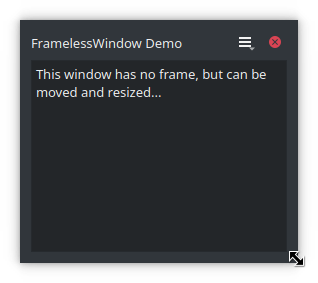

# frameless-qt-poc

FramelessWindow Demo for Qt Applications (POC)

## Why this exists?

Since Qt 5.15 there are two new [QWindow](https://doc.qt.io/qt-5/qwindow.html) slots (functions):
* [startSystemMove](https://doc.qt.io/qt-5/qwindow.html#startSystemMove)
* [startSystemResize](https://doc.qt.io/qt-5/qwindow.html#startSystemResize)

These functions can be used to implement frameless windows ( using the *Qt:FramelessWindowHint*
[window flag](https://doc.qt.io/qt-5/qt.html#WindowType-enum) ) that can be moved and resized
like normal windows having a frame and a title bar, but the application is totally free to
draw those elements. This is called Client Side Window Decorations (CSD).
There is a similar [QML based demo](https://github.com/johanhelsing/qt-csd-demo)
and also a [blog post](https://www.qt.io/blog/custom-window-decorations) by Johan Helsing.

This POC is not design oriented, but on functionality and simplicity. There are several other similar
demos with much more elaborated design, and based on native functions which may be of interest for
older Qt versions, for instance:
* [GoodWindow](https://github.com/antonypro/QGoodWindow)
* [qt-csd](https://github.com/Longhanks/qt-csd)

This is an easier way, and has the advantage of working on Window, macOS and Linux (both X11/xcb and
Wayland). It can be used with projects based on Qt 5.15 and Qt 6.x.

## Results

Tests built with Qt 5.15.2 and Qt 6.3.0

:heavy_check_mark: means that it is usable.

:x: means that it is not usable.

:question: means that the results are not conclusive.

| Platform:      | Qt5 + move window  | Qt5 + resize       | Qt6 + move window  | Qt6 + resize       |
| -------------- | ------------------ | ------------------ | ------------------ | ------------------ |
| Windows        | :heavy_check_mark: | :heavy_check_mark: | :heavy_check_mark: | :heavy_check_mark: |
| macOS          | :heavy_check_mark: | :x:                | :heavy_check_mark: | :heavy_check_mark: |
| Linux X11/xcb  | :heavy_check_mark: | :heavy_check_mark: | :heavy_check_mark: | :heavy_check_mark: |
| Linux Wayland  | :heavy_check_mark: | :heavy_check_mark: | :heavy_check_mark: | :heavy_check_mark: |
